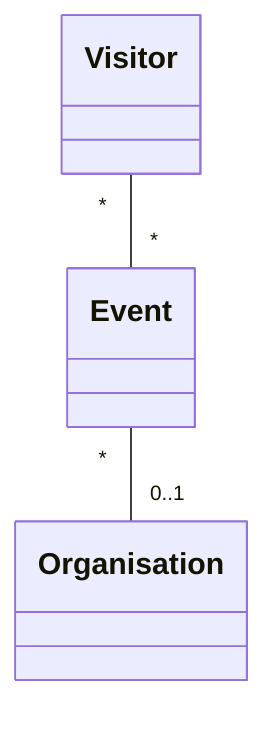
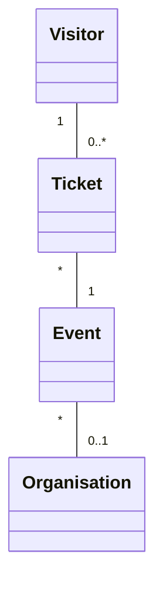
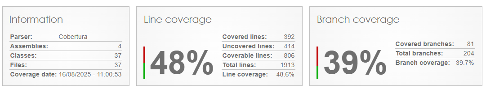

# Event Management - Project .NET Framework

* Naam: Jef Gaspar
* Studentennummer: 0163118-61
* Academiejaar: 24-25
* Klasgroep: INF202B
* Onderwerp: visitor * - * event * - 1 organisation

## Sprint 1



## Sprint 3

### Beide zoekcriteria ingevuld
```sql
SELECT "v"."VisitorId", "v"."City", "v"."Email", "v"."FirstName", "v"."LastName", "v"."PhoneNumber"
FROM "Visitors" AS "v"
WHERE instr(lower("v"."FirstName"), @__ToLower_0) > 0 AND instr(lower("v"."City"), @__ToLower_1) > 0
```

### Enkel zoeken op FirstName
```sql
SELECT "v"."VisitorId", "v"."City", "v"."Email", "v"."FirstName", "v"."LastName", "v"."PhoneNumber"
FROM "Visitors" AS "v"
WHERE instr(lower("v"."FirstName"), @__ToLower_0) > 0
```

### Enkel zoeken op City
```sql
SELECT "v"."VisitorId", "v"."City", "v"."Email", "v"."FirstName", "v"."LastName", "v"."PhoneNumber"
FROM "Visitors" AS "v"
WHERE instr(lower("v"."City"), @__ToLower_0) > 0
```

### Beide zoekcriteria leeg
```sql
SELECT "v"."VisitorId", "v"."City", "v"."Email", "v"."FirstName", "v"."LastName", "v"."PhoneNumber"
FROM "Visitors" AS "v"
```

### Sprint 4 



## Sprint 6

### Nieuwe organisatie

#### Request

```http request
POST https://localhost:7212/api/Organisations
Content-Type: application/json

{
  "orgName": "New Organisation",
  "orgDescription": "This is a test organisation.",
  "foundedDate": "2024-12-28",
  "contactEmail": "test@organisation.com"
}
```
#### Response
```http request
HTTP/2 201 Created
content-type: application/json; charset=utf-8
date: Sat, 28 Dec 2024 20:55:51 GMT
server: Kestrel
location: https://localhost:7212/api/Organisations?id=6
x-http2-stream-id: 3
transfer-encoding: chunked

{
  "orgId": 6,
  "orgName": "New Organisation",
  "orgDescription": "This is a test organisation.",
  "foundedDate": "2024-12-28",
  "contactEmail": "test@organisation.com",
  "events": null
}
Response file saved.
> 2024-12-28T215552.201.json

```


## Sprint 7

### opsomming gebruikers


### HTTP resuest 1 (Add a new organisation without being logged in (should fail))
```http request
POST https://localhost:7212/api/Organisations
Content-Type: application/json

{
  "orgName": "Unauthenticated Organisation",
  "orgDescription": "This organisation should fail to be added.",
  "foundedDate": "2024-12-29",
  "contactEmail": "unauth@organisation.com"
}
```
### Response 1
```http request
POST https://localhost:7212/api/Organisations

HTTP/2 401 Unauthorized
date: Thu, 27 Mar 2025 17:51:58 GMT
server: Kestrel
location: https://localhost:7212/Identity/Account/Login?ReturnUrl=%2Fapi%2FOrganisations
content-length: 0
x-http2-stream-id: 3
```

### HTTP resuest 2 (Add a new organisation with being logged in (should succeed))
```http request
POST https://localhost:7212/api/Organisations
Content-Type: application/json
Cookie: .AspNetCore.Identity.Application=CfDJ8J4O2G8AWJdIkQdD96CjqsJHsNw5wI3JWFCmU2Wv7_q7sIyRNAJ3FDw3DmBqrTlz6G1GfowMQLMf279e0a_Ej2X6BpWIYoyzEOjSw0YK5DAB4BDx59DyxD7mZJBkAUzflfKpGulc95hEo4U-wmsbV4XUNXGvogYG747RRoKprX7RYd2L4kNVIGqXZ4LmLeRvPYmJjO-xTwjK9IuaUqo1B1qvJK0N2PUiq9uA30HRvzdBHJStoakOfWmzs1fiB3MvtM7OgQKIqWX5bp1ZPBOjiGVnJuLP2YutZLNvMHxfw7O5Tfjmn0y0rehpow7VV6bk3RQHbqTbvEY9BiWS3uVY1I3E954IgbJdRFqy4OgJBjtrhT-6hJKKsQ4hMlyx29AOFhvhyxfOa6_xahanyEc1CLk-vVdO49ZTaWrijP_beVJ7dsl2vBOx72TmI4sG8vGChKZhiKiKJ2Xx2F7EXNPxuWjcBq1yxlYlBIZSjfhpjb6FS8HrLecvfihOmOs1Oyp_asB3mtCwflw895YHoQA3cN0BnR026Jji2AJFTQsmgE_YLwHTlnlxV5V7xJicERVGgLAMLEK57SPhRlI8Q00MAM1BSDmEe-xR9bC8MRs03KvedevJhgbFboTxXtekkGvYpgKpkYrKxUf3p5prCXVB6ccSt52jfNeiq720NSAoPKQLXCF-m1G9fcELT67mH0CwOLPB_zVBPU5R31nYvRHizEFcHQGfi26lq-X8XxEzHTYr8-epNjdzqJmSH8dyFUVtYy7drOh240JSt-1WIzsK6tluddN50YdZO7Ivem6OMhpu5Q-Jr9UauhLMF1Yd3J32wg

{
  "orgName": "Authenticated Organisation",
  "orgDescription": "This organisation should be added successfully.",
  "foundedDate": "2024-12-29",
  "contactEmail": "auth@organisation.com"
}
```

### Response 2
```http request
POST https://localhost:7212/api/Organisations

HTTP/2 201 Created
content-type: application/json; charset=utf-8
date: Thu, 27 Mar 2025 18:13:56 GMT
server: Kestrel
location: https://localhost:7212/api/Organisations?id=6
x-http2-stream-id: 3
transfer-encoding: chunked

{
  "orgId": 6,
  "orgName": "Authenticated Organisation",
  "orgDescription": "This organisation should be added successfully.",
  "foundedDate": "2024-12-29",
  "contactEmail": "auth@organisation.com",
  "events": null
}
Response file saved.
```


## Sprint 8

### Tests lokaal uitvoeren
```shell
dotnet test
```


### Complexe authorization tests
Tests.IntegrationTests.EventsApiControllerTests

### Verificatie tests
Tests.UnitTests.EventControllerUnitTests