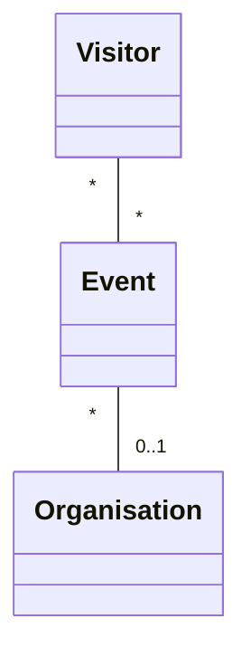
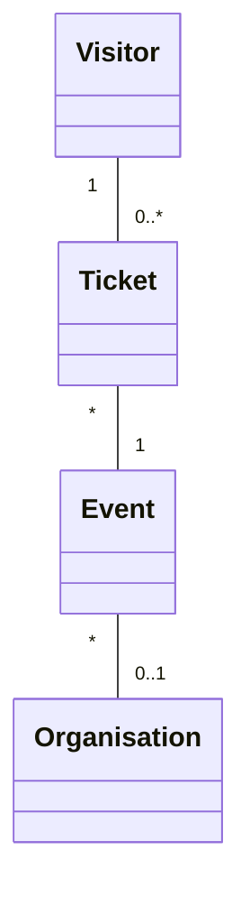

# Event Management - Project .NET Framework

* Naam: Jef Gaspar
* Studentennummer: 0163118-61
* Academiejaar: 24-25
* Klasgroep: INF202B
* Onderwerp: visitor * - * event * - 1 organisation

## Sprint 1



## Sprint 3

### Beide zoekcriteria ingevuld
```sql
SELECT "v"."VisitorId", "v"."City", "v"."Email", "v"."FirstName", "v"."LastName", "v"."PhoneNumber"
FROM "Visitors" AS "v"
WHERE instr(lower("v"."FirstName"), @__ToLower_0) > 0 AND instr(lower("v"."City"), @__ToLower_1) > 0
```

### Enkel zoeken op FirstName
```sql
SELECT "v"."VisitorId", "v"."City", "v"."Email", "v"."FirstName", "v"."LastName", "v"."PhoneNumber"
FROM "Visitors" AS "v"
WHERE instr(lower("v"."FirstName"), @__ToLower_0) > 0
```

### Enkel zoeken op City
```sql
SELECT "v"."VisitorId", "v"."City", "v"."Email", "v"."FirstName", "v"."LastName", "v"."PhoneNumber"
FROM "Visitors" AS "v"
WHERE instr(lower("v"."City"), @__ToLower_0) > 0
```

### Beide zoekcriteria leeg
```sql
SELECT "v"."VisitorId", "v"."City", "v"."Email", "v"."FirstName", "v"."LastName", "v"."PhoneNumber"
FROM "Visitors" AS "v"
```

### Sprint 4 



## Sprint 6

### Nieuwe organisatie

#### Request

```http request
POST https://localhost:7212/api/Organisations
Content-Type: application/json

{
  "orgName": "New Organisation",
  "orgDescription": "This is a test organisation.",
  "foundedDate": "2024-12-28",
  "contactEmail": "test@organisation.com"
}
```
#### Response
```http request
HTTP/2 201 Created
content-type: application/json; charset=utf-8
date: Sat, 28 Dec 2024 20:55:51 GMT
server: Kestrel
location: https://localhost:7212/api/Organisations?id=6
x-http2-stream-id: 3
transfer-encoding: chunked

{
  "orgId": 6,
  "orgName": "New Organisation",
  "orgDescription": "This is a test organisation.",
  "foundedDate": "2024-12-28",
  "contactEmail": "test@organisation.com",
  "events": null
}
Response file saved.
> 2024-12-28T215552.201.json

```

