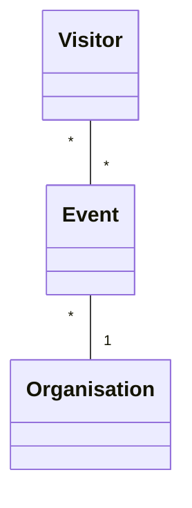

# Event Manager - Project .NET Framework

* Naam: Jef Gaspar
* Studentennummer: 0163118-61
* Academiejaar: 24-25
* Klasgroep: INF202B
* Onderwerp: visitor * - * event * - 1 organisation

## Sprint 1



## Sprint 3

### Beide zoekcriteria ingevuld
```sql
SELECT "v"."VisitorId", "v"."City", "v"."Email", "v"."FirstName", "v"."LastName", "v"."PhoneNumber"
FROM "Visitors" AS "v"
WHERE instr(lower("v"."FirstName"), @__ToLower_0) > 0 AND instr(lower("v"."City"), @__ToLower_1) > 0
```

### Enkel zoeken op FirstName
```sql
SELECT "v"."VisitorId", "v"."City", "v"."Email", "v"."FirstName", "v"."LastName", "v"."PhoneNumber"
FROM "Visitors" AS "v"
WHERE instr(lower("v"."FirstName"), @__ToLower_0) > 0
```

### Enkel zoeken op City
```sql
SELECT "v"."VisitorId", "v"."City", "v"."Email", "v"."FirstName", "v"."LastName", "v"."PhoneNumber"
FROM "Visitors" AS "v"
WHERE instr(lower("v"."City"), @__ToLower_0) > 0
```

### Beide zoekcriteria leeg
```sql
SELECT "v"."VisitorId", "v"."City", "v"."Email", "v"."FirstName", "v"."LastName", "v"."PhoneNumber"
FROM "Visitors" AS "v"
```

